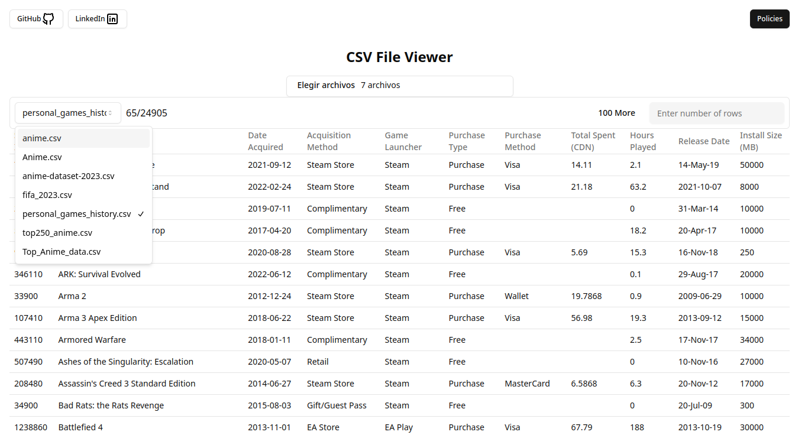

# CSV Viewer

CSV Viewer es una aplicación web que permite a los usuarios cargar y visualizar archivos CSV directamente en su navegador. La aplicación está diseñada para ser rápida y fácil de usar, sin almacenar información del usuario ni cargar archivos a servidores externos.

## Características

- Carga y visualización de archivos CSV.
- Interfaz de usuario sencilla y amigable.
- No almacena información del usuario ni los archivos cargados.

## Tecnologías Utilizadas

- [React](https://reactjs.org/)
- [Vite](https://vitejs.dev/)
- [TypeScript](https://www.typescriptlang.org/)

## Instalación

Para clonar y ejecutar la aplicación en tu máquina local:

```bash
git clone https://github.com/lauta-dev/csv-viewer.git
cd csv-viewer
pnpm install
pnpm run dev
```
# Contribuciones
¡Las contribuciones son bienvenidas! Si tienes alguna idea o mejora, no dudes en abrir un issue o un pull request.
